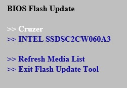

# To update your firmware:

1. Backup your data. There is a small possibility that updating your firmware can cause data loss.

### Downloading and preparing new firmware
1. In order to update your firmware, you will need a flash drive. 
2. You will want to put the firmware.rom file on a MBR formatted FAT partitioned drive.
3. If you are familiar with the process for doing so, you can skip ahead to the [_Writing new firmware_](README.md#writing-new-firmware) section.
4. The following are instructions for properly formatting your flash drive and putting the new firmware on the drive.

### Preparing Flash Drive
1. Plug in your flash drive.
2. Open the "Disks" program.
4. The left pannel of the "Disks" application shows all of the drives connected to your machine. Select the drive that represents your drive.
5. Select the menu button in the top right corner. Select "Format Disk".
6. A pop-up will appear asking how the drive should be formatted. The defaults are desired so select "Format...".
7. Confirm this execution by selecting "Format".
8. Once this process is complete, you should see the volume listed as "Free Space".
9. Select the "+" button to create a partition for this drive.
10. Once again the default settings here should be sufficient. However, you do need to add a name for the flash drive. In this example I named the drive "firmare" so I know what is on the drive when I plug it in. You can name the drive whatever you would like.
11. Select "Create" when you are done supplying a name for the drive.
12. The drive should now be labeled with the name you gave the drive followed by the size and the letters FAT.
13. Now mount the drive by selecting the "Play" button.
14. Now that the drive is ready, download the `firmware.rom` file from here: [meer2 firmware](firmware.rom). Click `Download` to begin the download of the firmware.
15. Copy over the firmware file to the flash drive.

### Writing new firmware
1. After saving and backing up all of your work, make sure the flash drive with the updated firmware is plugged into your computer.
2. Power off the machine.
3. Power back on the machine. As the machine is powering back up, hold down the 'F7' key.
4. After seeinsg the System76 logo, you should be brought to a Blue and grey screen with the title containing the words "Intel NUC Board". This should look somewhat similar to the following screenshot.

**Note: These images are for reference since these are screens you normally do not come across. These are not exact screenshots. The names of your drives will named differently according to the make and model of your drive.**

5. If you only have one USB drive connected to your machine, the name of that drive will be listed in white. *White text is a selected option, blue text is not selected*
6. Go ahead and select "Enter" when your flash drive is selected in white. Use the arrow keys to go up and down to change selections.
7. Next, you will be presented with whatever folders and files are on that flashdrive.
8. Select the `firmware.rom` file and hit "Enter" on your keyboard.
9. A blue pop-up will appear. You will then be asked "Are you sure you wish to udate the BIOS with "firmware.rom?". Hit "Enter" once again to confirm.
10. Your machine will now reboot, you will see the System76 logo once again.
10. The firmware update will now begin. This may take up to 5 minutes. The following screenshot will look similar to what will appear on your screen.

11. Keeping an eye on the update, when the update finishes, you will see the text that "Flash update has completed successfully". Promptly unplug the flashdrive as the machine will reboot shortly.
12. Your Meerkat should now reboot back into your operating system.

**Note:**
After the firmware update completes, if the system reboots with the flashdrive still plugged in, you may be brought to a yellow and black command line prompt titled: "EFI Shell version x". If this is the case, press the `ctrl`-`alt`-`del` keys all at once and your system will restart. Promptly remove the flashdrive and your system will reboot into your operating system.
